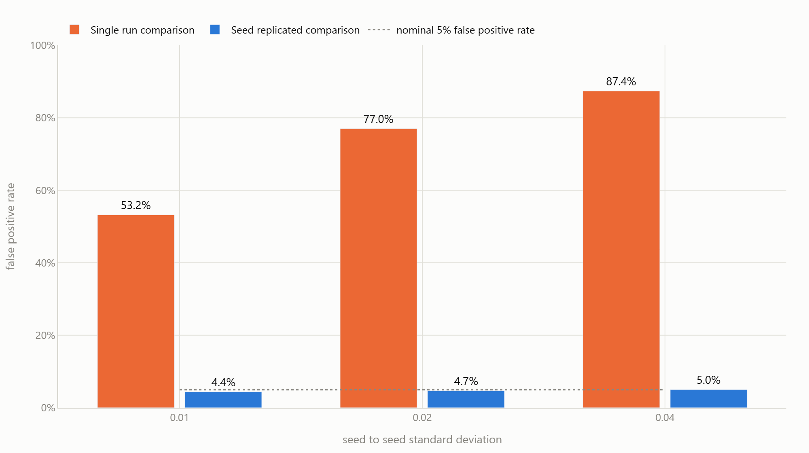
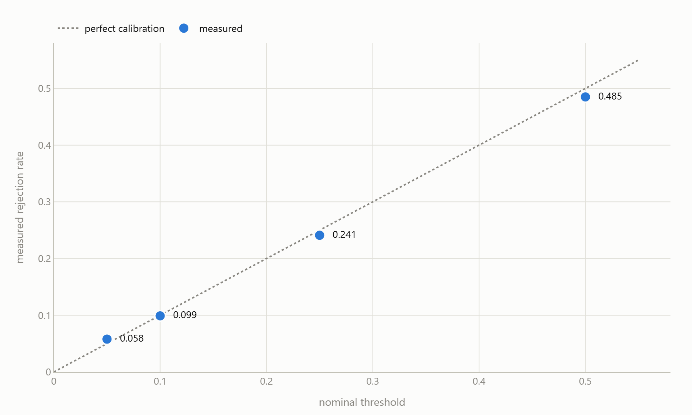
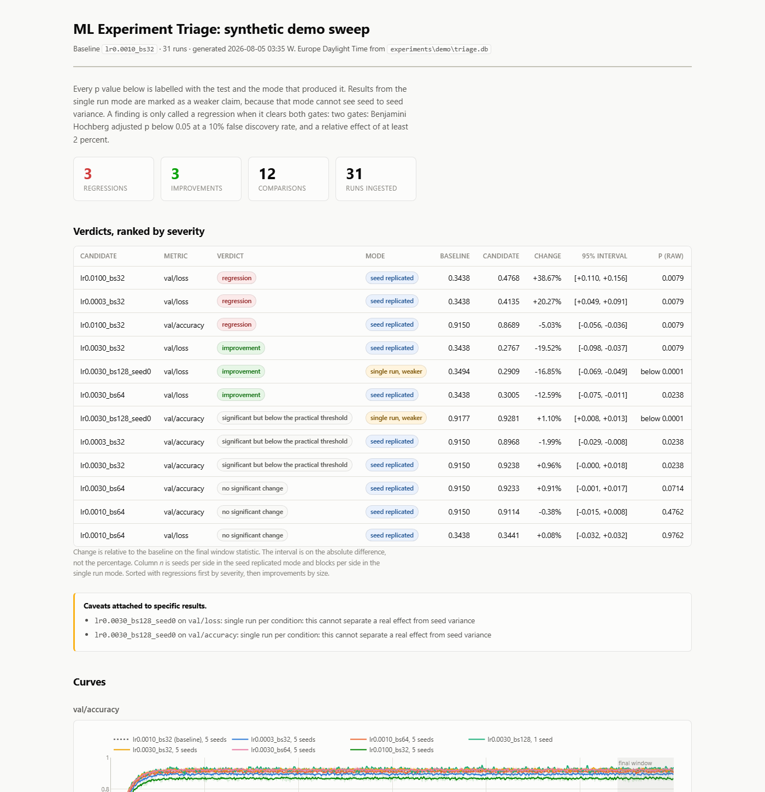
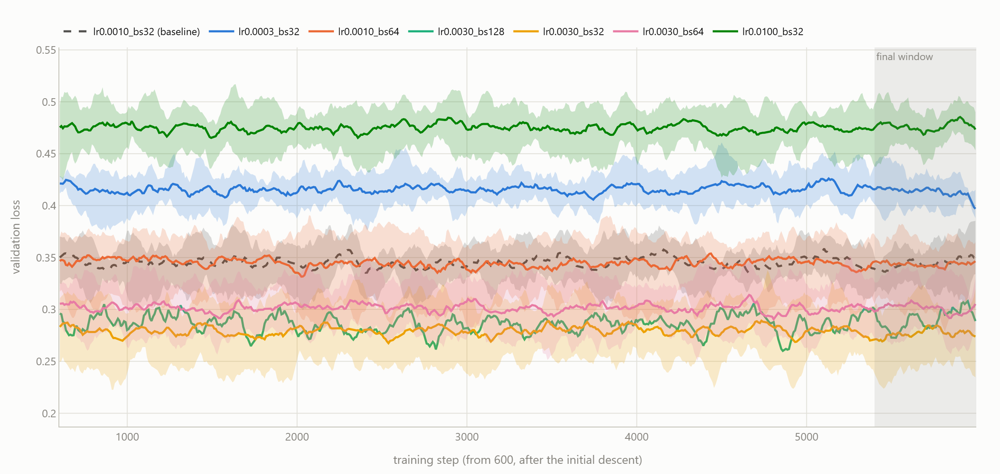
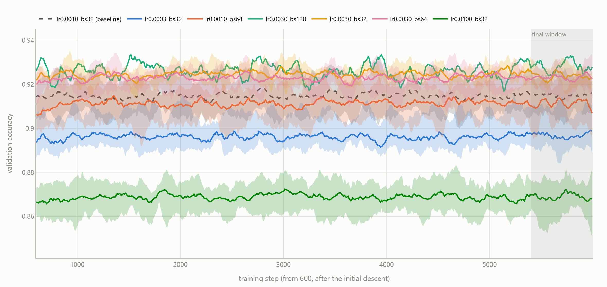
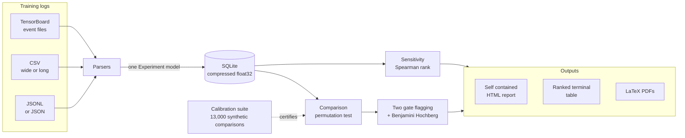

<h1 align="center">ML Experiment Triage</h1>

<p align="center">
  <strong>Turns a directory of training runs into a ranked, significance tested comparison.</strong><br>
  Which runs beat the baseline, by how much, with what confidence, and with the tool's own
  error rate measured rather than assumed.
</p>

<p align="center">
  <a href="https://github.com/Olajide-Badejo/ML-Experiment-Triage/actions/workflows/ci.yml">
    </a>
  
  
  
  <a href="LICENSE"></a>
</p>

---

## The problem

Two loss curves on a TensorBoard tab, one of them slightly lower at the end, and a decision made
on it. That is how most training runs get compared, and it fails in four ways at once:

- the **final point is mostly noise**, so the comparison rests on a single draw;
- curve values are **autocorrelated**, which breaks the standard significance tests;
- **run to run variance** is routinely larger than the effect being claimed;
- several **metrics are compared at once**, so something was always going to look significant.

This project replaces that with a stated hypothesis, a test whose assumptions the data actually
satisfies, and a calibration suite that proves the p values mean what they say.

---

## The result that matters

The single most useful measurement here. Both comparison modes were run thousands of times on
synthetic data with **a true effect of exactly zero**, so every rejection is a false positive.
The only difference between the two is whether the comparison had seed replicates to work with.

<picture>
  <source media="(prefers-color-scheme: dark)" srcset="assets/images/weak-mode-cost-dark.png">
  
</picture>

**Comparing one run against one run, on data where nothing is different, calls it a significant
difference most of the time.** That is not a flaw in this implementation. It is what the question
"are these two curves different" can answer when it has no information about how much a curve
moves between seeds.

The tool still offers that mode, because sometimes one run is all there is. It labels every
result from it as a weaker claim, in the terminal, in the HTML report and in the PDF.

---

## Calibration

A tool that produces p values is worth nothing unless its p values mean what they say. The
calibration suite generates about 13,000 synthetic comparisons whose true effect is set in
advance, runs the real comparison over them, and counts how often it is wrong.

| Measurement | Result | Gate |
|---|---|---|
| Type I error, seed replicated mode | **4.53%** (+/- 0.74), 3000 null cases | inside [2, 8] at a nominal 5 |
| Type I error, across seed variance 0.005 to 0.05 | 4.40%, 4.70%, 5.00% | inside [2, 8] |
| Power, seed replicated mode, large effect | **96.25%**, 800 cases | above 90% |
| Type I error, single run window block mode | **5.81%** (+/- 1.04), 1928 cases | inside [2, 8] |
| Power, single run mode, large effect | 100%, 291 cases | above 90% |
| Null p values uniform at 0.05 / 0.10 / 0.25 / 0.50 | 0.058 / 0.099 / 0.241 / 0.485 | within 3 standard errors |

Reproduce all of it with `make test-stats`, in about a minute. It is deterministic.

That last row matters more than it looks. Checking only that the error rate is right at 0.05 can
be passed by a test that is wrong in two compensating directions, so the suite checks the shape
of the whole null distribution.

<p align="center">
  <picture>
    <source media="(prefers-color-scheme: dark)" srcset="assets/images/calibration-uniformity-dark.png">
    
  </picture>
</p>

---

## What it produces

Run `make demo` and the tool synthesises 31 runs across 7 conditions in three different log
formats, ingests them, compares every condition against the baseline, and writes a single self
contained HTML file.

<p align="center">
  
</p>

### The verdict table

```text
candidate            metric           change     p adj  verdict
---------------------------------------------------------------
lr0.0100_bs32        val/loss        +38.67%    0.0159  regression
lr0.0003_bs32        val/loss        +20.27%    0.0159  regression
lr0.0100_bs32        val/accuracy     -5.03%    0.0159  regression
lr0.0030_bs32        val/loss        -19.52%    0.0159  improvement
lr0.0030_bs128_seed0 val/loss        -16.85%    0.0006  improvement  [weaker mode]
lr0.0030_bs64        val/loss        -12.59%    0.0317  improvement
lr0.0030_bs128_seed0 val/accuracy     +1.10%    0.0006  significant but below the practical threshold
lr0.0003_bs32        val/accuracy     -1.99%    0.0317  significant but below the practical threshold
lr0.0030_bs32        val/accuracy     +0.96%    0.0317  significant but below the practical threshold
lr0.0030_bs64        val/accuracy     +0.91%    0.0857  no significant change
lr0.0010_bs64        val/accuracy     -0.38%    0.5195  no significant change
lr0.0010_bs64        val/loss         +0.08%    0.9762  no significant change

best condition found: lr0.0030_bs32 (ground truth: lr0.0030_bs32)
```

The tool finds the condition that is genuinely best, and does not flag the condition whose true
effect is real but negligible.

Read the fifth row against the fourth. Both are improvements of about the same size, but the
single seed condition reports an adjusted p of 0.0006 where the five seed condition reports
0.0159. That gap is the anticonservatism from the chart above, appearing in the demo itself.
It is why the row carries a label.

### The curves, with seed spread drawn in

<picture>
  <source media="(prefers-color-scheme: dark)" srcset="assets/images/val-loss-curves-dark.png">
  
</picture>

Each line is the mean across seeds; each band is the **full range across seeds** of that
condition. Plotting one line per condition would hide the single thing this tool exists to
account for. With the band drawn you can see it directly:

- `lr0.0100_bs32` (green) and `lr0.0003_bs32` (blue) sit clearly outside the baseline band. Both
  are flagged as regressions.
- `lr0.0010_bs64` (orange) overlaps the baseline almost exactly. Its true effect is real but
  tiny, and it is correctly **not** flagged.
- The improvements at the bottom overlap each other, which is why their intervals are reported
  rather than a ranking being asserted.

<details>
<summary>Validation accuracy for the same runs</summary>

<picture>
  <source media="(prefers-color-scheme: dark)" srcset="assets/images/val-accuracy-curves-dark.png">
  
</picture>

</details>

*Both figures are smoothed for display, so that what remains in the band is the seed to seed
spread rather than within run measurement noise. The statistic itself uses a nine point window.*

---

## Reports

| Document | What is in it |
|---|---|
| **[Main report (PDF, 17 pages)](report/main.pdf)** | Background, exact methodology for both modes, implementation, measured results, discussion and limitations |
| **[Debug report (PDF, 6 pages)](report_debug/debug_report.pdf)** | Nine problems hit during the build, each with symptom, root cause, the options considered, the fix and its verification |
| [Methodology](docs/methodology.md) | The statistics written out for a sceptical reader |
| [Design decisions](docs/DESIGN_DECISIONS.md) | What was chosen, what was rejected, and what would change my mind |
| [Engineering log](docs/ENGINEERING_LOG.md) | Dated entries behind the debug report |
| [Build record](PROGRESS.md) | Phase by phase, with the checks run at each gate |

---

## How it works



**Ingest is the only stage that touches log files.** Everything after it reads SQLite, so a
comparison takes milliseconds and can be rerun freely. Re-ingesting an unchanged source does no
work, and an interrupted ingest loses at most the run in flight.

---

## Quick start

```bash
make env      # Python 3.13 venv, pinned dependencies
make demo     # synthesise 31 runs, ingest, compare, write the HTML report
make test     # the full suite, including the calibration gates
make all      # everything from a clean tree, including both PDFs
```

Against your own runs, one directory per run with an optional `config.json`:

```bash
triage ingest  path/to/runs --database triage.db
triage compare --database triage.db --baseline my_baseline_variant
triage report  --database triage.db --baseline my_baseline_variant --output report.html
```

<details>
<summary>Expected layout for your own runs</summary>

```text
runs/
  lr0.001_bs32_seed0/
    config.json                       # {"learning_rate": 0.001, "batch_size": 32, "seed": 0}
    events.out.tfevents.1700000000.host
  lr0.001_bs32_seed1/
    config.json
    metrics.csv                       # step,train/loss,val/accuracy
  lr0.003_bs32_seed0/
    config.json
    metrics.jsonl                     # {"step": 0, "val/loss": 2.30}
```

Runs that differ only in their `seed` are grouped into one condition automatically, which is
what makes the strong comparison mode available.

</details>

---

## The method, briefly

**The statistic.** The mean of the last 10% of a smoothed curve, minimum 20 points. The final
window is what people mean by "how good did it get", and one final point is mostly noise.

**The test.** A two sided permutation test. Training curve values are autocorrelated and rarely
normal, which breaks what a t test needs; a permutation test needs only exchangeability under
the null, which is what the null already asserts.

**Two modes, and the mode is never a choice.**

| | Seed replicated | Single run window block |
|---|---|---|
| Data needed | 2 or more runs per condition | 1 run per side |
| Unit of analysis | the run | blocks of the final window |
| Null hypothesis | the condition label is exchangeable across runs | the two windows are blockwise exchangeable |
| Sees seed variance | **yes**, it is inside the null distribution | **no** |
| Claim strength | strong | weaker, and labelled everywhere |

Two or more runs on both sides selects the strong mode; anything less falls back. The choice is
made by what data exists, never by which produces the smaller p value.

**Two gates for a regression.** An adjusted p below 0.05 **and** a relative effect of at least
2%. With enough data a meaningless 0.05% change becomes statistically significant, so pairing
significance with a visible practical threshold is the difference between a tool people keep and
a tool people mute.

**Multiplicity.** Benjamini Hochberg at a 10% false discovery rate, not Bonferroni: training
metrics are strongly correlated and Bonferroni assumes worst case dependence. On the fifteen p
values in the original 1995 paper it rejects three where the step up procedure rejects four, and
the implementation here is tested against exactly that example.

---

## What it will not tell you

Documented, tested, and printed next to the results rather than buried.

- **A near zero rank correlation means "not monotone", never "no effect".** The demo sweep gives
  learning rate an optimum in the middle of its range, which is a U shape, and Spearman is blind
  to a U shape however strong the effect. Batch size, swept monotonically, shows the stronger
  correlation while driving the smaller effect. There is a test named for this so it does not
  get quietly "fixed".
- **Sensitivity is association across a sweep, not a controlled effect.** A parameter only ever
  changed alongside another cannot be separated from it.
- **The single run mode cannot see seed variance**, with the consequences measured above.
- **The single run mode refuses rather than guesses.** If the final window does not hold at
  least eight effectively independent blocks, it raises an error naming the remedy instead of
  returning a p value it cannot stand behind.
- **With three seeds a side, no result can reach p below 0.05.** There are only twenty distinct
  label assignments, so the smallest attainable p value is 0.1. The tool reports this as
  inconclusive rather than as "no significant change", because a negative result from a design
  that could not have found anything is not a finding.
- **TensorBoard support covers scalars only.** Histograms and images are out of scope.

---

## Engineering notes

A few things worth pulling out of the [debug report](report_debug/debug_report.pdf).

**The calibration suite paid for itself on its first run.** It measured the window block mode at
a 12% type I error against a nominal 5, in code that looked correct and passed every mechanics
test written for it. Two causes: the autocorrelation time was being estimated on the two windows
*concatenated*, where the step change at the join reads as long range dependence; and the block
length was one autocorrelation time, at which neighbouring block means are still correlated. The
fix that mattered most was making the mode **refuse** below eight blocks rather than shortening
blocks to fit, since shortening is precisely the failure.

**Three test failures turned out to be the test's fault, not the code's.** In each case the
temptation was to loosen the assertion until it passed; in each case the right move was to work
out what the code was actually doing and assert that precisely. One of them turned a bug report
into a documented limitation of the method.

**Reports are byte reproducible, and that is tested.** The test caught a real defect: Plotly
assigns each figure a random identifier, so every report differed from the last, which made the
reproducibility claim unverifiable in practice.

---

## Measured wall clock

Intel Core i7-14700K, 32 GB, Windows 11 Pro. Everything runs on CPU; the GPU in this machine is
not used at any point.

| Step | Time |
|---|---|
| `make test-stats`, the calibration suite, about 13,000 synthetic comparisons | 60 s |
| `make test`, the full suite, 122 tests | 77 s |
| `make demo`, synthesise 31 runs, ingest, compare, report | 17 s |
| `make all` from a clean tree | 137 s |
| `make all` from a fresh clone, including creating the environment | 205 s |

Measured, not estimated. The last row is the one that matters: `git clone` followed by
`make all` produces every artifact in this repository, including both PDFs, with no manual step.

---

## Repository layout

```text
triage/            the library
  core/            Experiment model and SQLite store
  parsers/         TensorBoard, CSV and JSONL readers
  analysis/        comparison, regression flagging, sensitivity
  report/          self contained HTML reporting
  calibration.py   the measured error rates, as the single source
  synthetic.py     controlled curve generator with known ground truth
tests/
  unit/            96 tests: parsers, store, model, gates, sensitivity
  statistics/      the calibration gates
  integration/     the CLI end to end over the synthetic sweep
examples/          the synthetic sweep and the demo workflow
docs/              methodology, design decisions, engineering log
report/            main report source and PDF
report_debug/      debug report source and PDF
scripts/           dash guard, PDF build, asset and image generation
```

---

## Requirements

Python 3.13 (3.12 works) and the pinned packages in `requirements.txt`. A TeX installation is
needed only to rebuild the PDFs, which are committed. Everything runs on CPU.

## Licence

[MIT](LICENSE). Sole author, Olajide Badejo.
