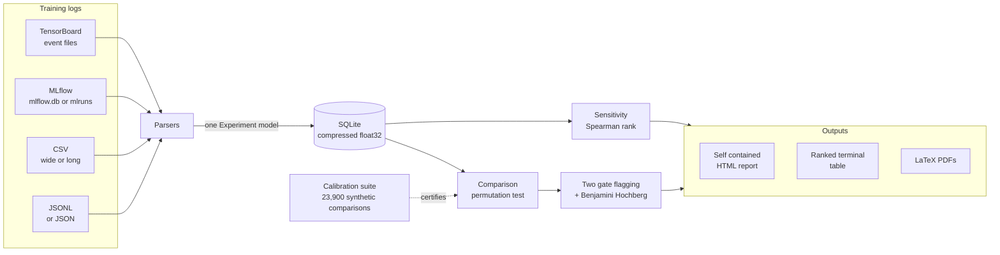

<h1 align="center">ML Experiment Triage</h1>

<p align="center">
  <strong>Turns a directory of training runs into a ranked, significance tested comparison.</strong><br>
  Which runs beat the baseline, by how much, with what confidence, and with the tool's own
  error rate measured rather than assumed.
</p>

<p align="center">
  <a href="https://github.com/Olajide-Badejo/ML-Experiment-Triage/actions/workflows/ci.yml">
    </a>
  <a href="https://olajide-badejo.github.io/ML-Experiment-Triage/">
    </a>
  
<!-- calibration:badge -->
  
<!-- /calibration:badge -->
  <a href="https://github.com/Olajide-Badejo/ML-Experiment-Triage/blob/main/LICENSE"></a>
</p>

---

## Install

```bash
pip install ml-experiment-triage
```

The core install is **numpy and scipy, and nothing else**: that is the statistics API, the
JSONL parser and the MLflow parser. Everything heavier is an extra, so a project that wants a
permutation test does not also install pandas, plotly, jinja2 and tensorboard.

```bash
pip install "ml-experiment-triage[cli]"   # the command line tool, reports included
pip install "ml-experiment-triage[all]"   # and the browser driven demo
```

### The command line, in three lines

```bash
triage ingest  path/to/runs --database triage.db
triage compare --database triage.db --baseline my_baseline_variant
triage report  --database triage.db --baseline my_baseline_variant --output report.html
```

One directory per run, with an optional `config.json`. Runs that differ only in their `seed`
are grouped into one condition automatically, which is what makes the strong comparison mode
available. `triage demo` does the whole thing over a synthetic sweep in a temporary directory,
so a fresh install can demonstrate itself with no clone.

### The library, in fifteen lines

```python
from triage import Store, compare_all, classify, rank, RegressionConfig

with Store("triage.db") as store:
    results = compare_all(store.load_all(), baseline="lr0.0010_bs32")

config = RegressionConfig()
for finding in rank(classify(results, config)):
    print(finding.candidate, finding.tag, finding.verdict, finding.adjusted_p)

for refusal in results.refusals:
    print("not compared:", refusal.candidate, refusal.tag, refusal.reason)
```

The last three lines are the half most tools leave out: a comparison that could not be made is
a record on `results.refusals`, not a silent absence. Full walkthrough in the
[library tutorial](https://olajide-badejo.github.io/ML-Experiment-Triage/library/).

---

## The problem

Two loss curves on a TensorBoard tab, one of them slightly lower at the end, and a decision made
on it. That is how most training runs get compared, and it fails in four ways at once:

- the **final point is mostly noise**, so the comparison rests on a single draw;
- curve values are **autocorrelated**, which breaks the standard significance tests;
- **run to run variance** is routinely larger than the effect being claimed;
- several **metrics are compared at once**, so something was always going to look significant.

This project replaces that with a stated hypothesis, a test whose assumptions the data actually
satisfies, and a calibration suite that proves the p values mean what they say.

---

## The result that matters

The single most useful measurement here. Both comparison modes were run thousands of times on
synthetic data with **a true effect of exactly zero**, so every rejection is a false positive.
The only difference between the two is whether the comparison had seed replicates to work with.

<picture>
  <source media="(prefers-color-scheme: dark)" srcset="assets/images/weak-mode-cost-dark.png">
<!-- calibration:weakmodefigure -->
  
<!-- /calibration:weakmodefigure -->
</picture>

**Comparing one run against one run, on data where nothing is different, calls it a significant
difference most of the time.** That is not a flaw in this implementation. It is what the question
"are these two curves different" can answer when it has no information about how much a curve
moves between seeds.

The tool still offers that mode, because sometimes one run is all there is. It labels every
result from it as a weaker claim, in the terminal, in the HTML report and in the PDF.

---

## Calibration

A tool that produces p values is worth nothing unless its p values mean what they say. The
calibration suite generates about <!-- calibration:comparisons -->23,900<!-- /calibration:comparisons --> synthetic comparisons whose true effect is set in
advance, runs the real comparison over them, and counts how often it is wrong.

<!-- calibration:headline -->
| Measurement | Result | Gate |
|---|---|---|
| Type I error, seed replicated | 4.53 percent (+/- 0.74), 3000 null cases | [2, 8] percent |
| Type I error across seed variance | 4.40, 4.70, 5.00 percent, sigma 0.005 to 0.05 | [2, 8] percent |
| Power, seed replicated | 96.25 percent, 800 cases | above 90 percent |
| Type I error, window block | 6.28 percent (+/- 1.07), 1989 cases, 11 refused | [2, 8] percent |
| Power, window block | 100 percent, 300 cases | above 90 percent |
| Type I error, paired clustered | 4.90 percent (+/- 1.34), 1000 cases, 10 clusters of 4 pairs | [2, 8] percent |
| Null p value uniformity | 0.0580, 0.0993, 0.2407, 0.4847, 1500 cases | within 3 standard errors |
<!-- /calibration:headline -->

Reproduce all of it with `nox -s test_stats`, in <!-- calibration:statsclock -->110 s<!-- /calibration:statsclock --> on the machine
below. It is deterministic. Every number published anywhere in this repository is rendered from
`triage/calibration.py` by `scripts/render_calibration_docs.py`, and CI fails if a document and
the measurement disagree.

### The designs the test is not exact in

Those gates measure the design a permutation test is exact in: the same number of runs on both
sides, drawn with the same spread. Real sweeps are neither. The setting that was already trusted
has usually been run the most times and moves the least, and comparing seven of it against three
of something noisier is where a permutation test built on a raw mean difference quietly falls
apart. Every cell below has a true effect of exactly zero, so every rejection is a false positive.

<!-- calibration:designs -->
| Design | Type I error at a nominal 5 | Gate |
|---|---|---|
| Unequal spread, 5 narrow against 5 wide | 7.83 percent (+/- 1.52), 1200 null cases, sigma 0.01 against 0.05 | [2, 10] percent |
| Unequal spread, 3 narrow against 7 wide | 2.08 percent (+/- 0.81), 1200 null cases, sigma 0.01 against 0.05 | [1, 15] percent |
| Unequal spread, 7 narrow against 3 wide | 12.92 percent (+/- 1.90), 1200 null cases, sigma 0.01 against 0.05 | [1, 15] percent |
| Unequal counts only, 7 against 3 | 4.25 percent (+/- 1.14), 1200 null cases, one spread | [2, 8] percent |
| Heavy tailed noise, Student t at 3 df | 5.00 percent (+/- 1.23), 1200 null cases, 5 runs a side | [2, 8] percent |
| Paired clustered, macro F1 | 2.00 percent (+/- 1.23), 500 null cases, a discrete statistic | at most 8 percent |
| Paired, clustering ignored | 12.10 percent, 1000 null cases, the same clustered data | measured, not gated |
<!-- /calibration:designs -->

The statistic permuted is the Welch t rather than the difference of means, which is what keeps
those cells near nominal (Janssen 1997). It is not magic: with three runs on the wider side the
variance that studentizes the statistic is itself estimated from three numbers, and the measured
12.92 percent is published rather than smoothed over. The tool warns on exactly that design.

That last row matters more than it looks. Checking only that the error rate is right at 0.05 can
be passed by a test that is wrong in two compensating directions, so the suite checks the shape
of the whole null distribution.

<p align="center">
  <picture>
    <source media="(prefers-color-scheme: dark)" srcset="assets/images/calibration-uniformity-dark.png">
    
  </picture>
</p>

---

## What it produces

`triage demo` synthesises 31 runs across 7 conditions in three different log formats, ingests
them, compares every condition against the baseline, and writes a single self contained HTML
file.

<p align="center">
  
</p>

### The verdict table

```text
candidate            metric           change     p adj  verdict
---------------------------------------------------------------
lr0.0100_bs32        val/loss        +38.67%    0.0198  regression
lr0.0003_bs32        val/loss        +20.27%    0.0198  regression
lr0.0100_bs32        val/accuracy     -5.03%    0.0198  regression
lr0.0030_bs32        val/loss        -19.52%    0.0198  improvement
lr0.0030_bs128_seed0 val/loss        -16.64%    0.0001  improvement  [weaker mode]
lr0.0030_bs64        val/loss        -12.59%    0.0340  improvement
lr0.0030_bs128_seed0 val/accuracy     +1.13%    0.0001  significant but below the practical threshold  [weaker mode]
lr0.0003_bs32        val/accuracy     -1.99%    0.0340  significant but below the practical threshold
lr0.0030_bs32        val/accuracy     +0.96%    0.0340  significant but below the practical threshold
lr0.0030_bs64        val/accuracy     +0.91%    0.0893  no significant change
lr0.0010_bs64        val/accuracy     -0.38%    0.5291  no significant change
lr0.0010_bs64        val/loss         +0.08%    0.9762  no significant change

best condition found: lr0.0030_bs32 (ground truth: lr0.0030_bs32)
```

The tool finds the condition that is genuinely best, and does not flag the condition whose true
effect is real but negligible.

Read the fifth row against the fourth. Both are improvements of about the same size, but the
single seed condition reports an adjusted p of 0.0001 where the five seed condition reports
0.0198. The two are corrected in separate families, one per comparison mode, so neither is
inflating the other's denominator; the gap that remains is the anticonservatism from the chart
above, appearing in the demo itself. It is why the row carries a label.

### The curves, with seed spread drawn in

<picture>
  <source media="(prefers-color-scheme: dark)" srcset="assets/images/val-loss-curves-dark.png">
  
</picture>

Each line is the mean across seeds; each band is the **full range across seeds** of that
condition. Plotting one line per condition would hide the single thing this tool exists to
account for. With the band drawn you can see it directly:

- `lr0.0100_bs32` (green) and `lr0.0003_bs32` (blue) sit clearly outside the baseline band. Both
  are flagged as regressions.
- `lr0.0010_bs64` (orange) overlaps the baseline almost exactly. Its true effect is real but
  tiny, and it is correctly **not** flagged.
- The improvements at the bottom overlap each other, which is why their intervals are reported
  rather than a ranking being asserted.

<details>
<summary>Validation accuracy for the same runs</summary>

<picture>
  <source media="(prefers-color-scheme: dark)" srcset="assets/images/val-accuracy-curves-dark.png">
  
</picture>

</details>

*Both figures are smoothed for display, so that what remains in the band is the seed to seed
spread rather than within run measurement noise. The statistic itself uses a nine point window.*

---

## The reference workload: browser autofill

A tool that ranks training runs needs a training run of its own to rank. So this repository
carries one real machine learning problem end to end: classifying browser form fields into
WHATWG autocomplete tokens, across locales whose address formats disagree. It exercises every
axis the tool advertises at once, and it runs on CPU in seconds.

The last stage points the trained classifier at real pages in headless Chrome, fills them under
a calibrated fill or skip policy, and reads every value back out of the DOM to score it:

<p align="center">
  
</p>

Six pages, two locales, 71 fields. The n gram model fills 64 of them at a fill accuracy of
1.0000; the keyword baseline fills 30 at 0.8667; a local 12B LLM fills 42 at 0.9286 and takes
six seconds a field where the numpy model takes microseconds. Those task metrics are then
compared **by this tool, through the ordinary `ingest` and `compare` verbs with no autofill
specific flag**: the model beats the rules baseline by +151.40 percent on reward, adjusted
p 0.0002.

Everything about it, including a measured finding that goes against the design (the fill or skip
policy loses to always filling on a split where the classifier is 98.5 percent accurate), is in
[the autofill page](https://olajide-badejo.github.io/ML-Experiment-Triage/autofill/). The
[local LLM layer](https://olajide-badejo.github.io/ML-Experiment-Triage/llm/) documents the
retrieval ablation and why there is no vector database.

---

## Used by

**[`Autofill_audit`](https://github.com/Olajide-Badejo/Autofill_audit) is a real consumer.** It
is a Playwright driven form field auditor with a 392 rule engine, a calibrated ONNX model and an
optional local LLM, and it depends on this package for its statistics: one importer, one module,
with an AST test that fails if a second one appears. Its five filed issues are the consumer
contract this release closes, and they are the reason the core install is numpy and scipy alone.

**[`PyTorch-Performance-and-Health-Toolkit`](https://github.com/Olajide-Badejo/PyTorch-Performance-and-Health-Toolkit)
is an interop partner, not a dependent.** It does not import this package and cannot easily: its
Python floor is 3.11 and this one's is 3.12. What connects the two is that it is a second,
independent producer of training logs, which is the only real test of whether these parsers work
on somebody else's format rather than on their own fixtures. Its JSONL schema v2 now ingests
directly, header lines, string `"NaN"` and all, and its grounding design for LLM output is
adopted here with credit.

Both, and the namespace collision between them, are written up in
[the ecosystem page](https://olajide-badejo.github.io/ML-Experiment-Triage/ecosystem/).

---

## Documentation

**[The documentation site](https://olajide-badejo.github.io/ML-Experiment-Triage/)** carries all
of the below, plus an API reference rendered from the docstrings themselves.

| Document | What is in it |
|---|---|
| **[Main report (PDF, 17 pages)](https://github.com/Olajide-Badejo/ML-Experiment-Triage/blob/main/report/main.pdf)** | Background, exact methodology for both modes, implementation, measured results, discussion and limitations |
| **[Debug report (PDF, 6 pages)](https://github.com/Olajide-Badejo/ML-Experiment-Triage/blob/main/report_debug/debug_report.pdf)** | Nine problems hit during the build, each with symptom, root cause, the options considered, the fix and its verification |
| [Methodology](https://olajide-badejo.github.io/ML-Experiment-Triage/methodology/) | The statistics written out for a sceptical reader |
| [Library tutorial](https://olajide-badejo.github.io/ML-Experiment-Triage/library/) | Calling the statistics from your own code |
| [Design decisions](https://olajide-badejo.github.io/ML-Experiment-Triage/DESIGN_DECISIONS/) | What was chosen, what was rejected, and what would change my mind |
| [The autofill vertical](https://olajide-badejo.github.io/ML-Experiment-Triage/autofill/) | The reference workload: taxonomy, generator, model, policy, agentic demo |
| [Local LLM layer](https://olajide-badejo.github.io/ML-Experiment-Triage/llm/) | The Ollama models, the retrieval design, the measured ablation and why there is no vector database |
| [Ecosystem](https://olajide-badejo.github.io/ML-Experiment-Triage/ecosystem/) | The three sibling repositories, the shared taxonomy and the name collision |
| [Engineering log](https://olajide-badejo.github.io/ML-Experiment-Triage/ENGINEERING_LOG/) | Dated entries behind the debug report |
| [Changelog](https://github.com/Olajide-Badejo/ML-Experiment-Triage/blob/main/CHANGELOG.md) | Every behaviour change, with a section addressed to consumers |
| [Build record](https://github.com/Olajide-Badejo/ML-Experiment-Triage/blob/main/PROGRESS.md) | Phase by phase, with the checks run at each gate |

---

## How it works



**Ingest is the only stage that touches log files.** Everything after it reads SQLite, so a
comparison takes milliseconds and can be rerun freely. Re-ingesting an unchanged source does no
work, and an interrupted ingest loses at most the run in flight.

**Exit codes**, so a CI gate can tell the cases apart. `triage --help` prints the same table.

| Code | Meaning |
|---|---|
| 0 | success |
| 1 | a bug in triage: an unexpected exception, with its traceback |
| 2 | a usage error, or a failure the tool foresaw, reported as `error: ...` |
| 3 | the work was done, but at least one run failed to parse |
| 4 | the run finished having performed zero comparisons |

Code 4 is the one worth wiring into a gate: a `compare` that compared nothing used to exit 0,
so a build could go green because every comparison had been refused.

<details>
<summary>Expected layout for your own runs</summary>

```text
runs/
  lr0.001_bs32_seed0/
    config.json                       # {"learning_rate": 0.001, "batch_size": 32, "seed": 0}
    events.out.tfevents.1700000000.host
  lr0.001_bs32_seed1/
    config.json
    metrics.csv                       # step,train/loss,val/accuracy
  lr0.003_bs32_seed0/
    config.json
    metrics.jsonl                     # {"step": 0, "val/loss": 2.30}
```

A run's identity is its path relative to the ingest root, so two `seed0` directories under
different sweeps are two runs and not one.

</details>

<details>
<summary>Reading MLflow runs</summary>

Both of MLflow's backends are read directly, with no MLflow installed and no extra needed:

```bash
triage ingest path/to/mlflow.db --database triage.db   # the SQLite backend
triage ingest path/to/mlruns    --database triage.db   # the file store
```

A tracking database holds many runs, so each becomes its own run named
`<database>/<run_uuid>`; a file store run keeps its directory path. MLflow params become the
run config, with numbers read as numbers, so an MLflow sweep reaches the sensitivity ranking
like any other.

**Versions.** The four tables read out of the SQLite backend (`runs`, `metrics`, `params`,
`tags`) are unchanged in these fields from MLflow 1.x through 3.x, and the `is_nan` column
added in 1.9 is optional here. The `mlruns/` file store is read as MLflow froze it: MLflow put
that backend into maintenance mode and made SQLite the default in 3.7 (December 2025), which is
what makes both targets safe to read without the library.

</details>

---

## The method, briefly

**The statistic.** The mean of the last 10% of a smoothed curve, minimum 20 points. The final
window is what people mean by "how good did it get", and one final point is mostly noise.

**The test.** A two sided permutation test. Training curve values are autocorrelated and rarely
normal, which breaks what a t test needs; a permutation test needs only exchangeability under
the null, which is what the null already asserts.

**Two modes, and the mode is never a choice.**

| | Seed replicated | Single run window block |
|---|---|---|
| Data needed | 2 or more runs per condition | 1 run per side |
| Unit of analysis | the run | blocks of the final window |
| Null hypothesis | the condition label is exchangeable across runs | the two windows are blockwise exchangeable |
| Sees seed variance | **yes**, it is inside the null distribution | **no** |
| Claim strength | strong | weaker, and labelled everywhere |

Two or more runs on both sides selects the strong mode; anything less falls back. The choice is
made by what data exists, never by which produces the smaller p value.

**A third mode, for evaluations rather than curves.** `paired_permutation` compares two
conditions scored on the same units, swapping labels within a unit and swapping whole clusters
together where the units are correlated. It takes the statistic as a callable, because the
quantity being compared is often not a mean of anything.

**Two gates for a regression.** An adjusted p at or below the false discovery rate **and** a
relative effect of at least 2%. With enough data a meaningless 0.05% change becomes statistically
significant, so pairing significance with a visible practical threshold is the difference between
a tool people keep and a tool people mute. On a metric whose baseline can be zero, set the gate in
the metric's own units with `--practical-threshold-absolute` instead: a relative gate divides by
the baseline, and dividing by zero downgrades a real regression to nothing.

**Multiplicity.** Benjamini Hochberg at FDR 5% by default, configurable with `--fdr`, not
Bonferroni: training metrics
are strongly correlated and Bonferroni assumes worst case dependence. On the fifteen p
values in the original 1995 paper it rejects three where the step up procedure rejects four, and
the implementation here is tested against exactly that example. There is one family per
comparison mode, so a weak mode p value never sits in a strong mode denominator.

---

## What it will not tell you

Documented, tested, and printed next to the results rather than buried.

- **A near zero rank correlation means "not monotone", never "no effect".** The demo sweep gives
  learning rate an optimum in the middle of its range, which is a U shape, and Spearman is blind
  to a U shape however strong the effect. Batch size, swept monotonically, shows the stronger
  correlation while driving the smaller effect. There is a test named for this so it does not
  get quietly "fixed".
- **Sensitivity is association across a sweep, not a controlled effect.** A parameter only ever
  changed alongside another cannot be separated from it.
- **The single run mode cannot see seed variance**, with the consequences measured above.
- **The single run mode refuses rather than guesses.** If the final window does not hold at
  least eight effectively independent blocks, it raises an error naming the remedy instead of
  returning a p value it cannot stand behind.
- **With three seeds a side, no result can reach p below 0.05.** There are only twenty distinct
  label assignments, so the smallest attainable p value is 0.1. The tool reports this as
  inconclusive rather than as "no significant change", because a negative result from a design
  that could not have found anything is not a finding.
- **TensorBoard support covers scalars only.** Histograms and images are out of scope.
- **MLflow is read from disk, not through its API.** Artifacts, model registry entries and
  remote tracking servers are out of scope: what is read is a local `mlflow.db` or `mlruns/`
  tree, which is what a comparison of training curves needs and all of it.
- **Weights and Biases local files are not read.** Their offline directory format is an
  undocumented binary transaction log; the supported path is a user side CSV export into the
  CSV parser.

---

## Engineering notes

A few things worth pulling out of the [debug report](https://github.com/Olajide-Badejo/ML-Experiment-Triage/blob/main/report_debug/debug_report.pdf).

**The calibration suite paid for itself on its first run.** It measured the window block mode at
a 12% type I error against a nominal 5, in code that looked correct and passed every mechanics
test written for it. Two causes: the autocorrelation time was being estimated on the two windows
*concatenated*, where the step change at the join reads as long range dependence; and the block
length was one autocorrelation time, at which neighbouring block means are still correlated. The
fix that mattered most was making the mode **refuse** below eight blocks rather than shortening
blocks to fit, since shortening is precisely the failure.

**Then it did it again.** The published calibration was measuring one design out of six: equal
counts, equal spreads. Adding the unbalanced and heteroscedastic arms found a raw mean difference
statistic running at 17.92% type I error on a 7 against 3 design, which the studentized statistic
brought to 12.92%. That number is published as it is rather than smoothed over, and the tool
warns on the design that produces it.

**Three test failures turned out to be the test's fault, not the code's.** In each case the
temptation was to loosen the assertion until it passed; in each case the right move was to work
out what the code was actually doing and assert that precisely. One of them turned a bug report
into a documented limitation of the method.

**Reports are byte reproducible, and that is tested.** The test caught a real defect: Plotly
assigns each figure a random identifier, so every report differed from the last, which made the
reproducibility claim unverifiable in practice.

---

## Developing on the repo

The user path is `pip install`. Development and CI install the committed PEP 751 `pylock.toml`,
which is the exact resolution every number this project publishes was measured under.

```bash
nox -s env          # a .venv from pylock.toml, plus this package editable
nox                 # lint, typecheck and the test suite: what CI runs first
nox -s test -- -m "not slow"   # the inner loop, everything but the calibration gates
nox -s test_stats   # the calibration gates, with their measurements printed
nox -s docs-site    # build the documentation site, strict
nox -s package      # build the wheel and prove it installs and runs somewhere new
```

`noxfile.py` is the canonical runner on every platform and `nox -l` lists every session. The
Makefile is a thin wrapper that forwards to it, so `make env`, `make test`, `make demo` and
`make all` do the same work for anyone who has GNU Make. `make all` from a clean tree builds the
environment, lints, type checks, runs the full suite including the calibration gates,
regenerates the demo sweep and database, and compiles both PDFs, with no manual step.

`CONTRIBUTING.md` covers the commit hooks, what the build will refuse, and the rule that matters
most. `pre-commit install` is optional: a contributor without it gets the same answer from CI a
few minutes later.

### Measured wall clock

Intel Core i7-14700K, 32 GB, Windows 11 Pro. Everything runs on CPU; the GPU in this machine is
used only by the optional local LLM layer.

| Step | Time |
|---|---|
| `nox -s test_stats`, the calibration suite, about <!-- calibration:comparisons -->23,900<!-- /calibration:comparisons --> synthetic comparisons | <!-- calibration:statsclock -->110 s<!-- /calibration:statsclock --> |
| `nox -s test`, the full suite at 1.1.0, 882 tests | 310 s |
| `nox -s demo`, synthesise 31 runs, ingest, compare, report | 31 s |
| `nox -s demo-autofill`, generate, sweep, evaluate, ingest, compare, report | 6 s at the quick sizes, LLM step skipped |
| `make all` from a clean tree | 137 s, measured at 1.0.0 and due a re-measure at release |
| `make all` from a fresh clone, including creating the environment | 205 s, measured at 1.0.0 |

Measured, not estimated. The last row is the one that matters: `git clone` followed by
`make all` produces every artifact in this repository, including both PDFs, with no manual step.

### Repository layout

```text
triage/            the library
  core/            Experiment and Outcomes models, SQLite store
  parsers/         TensorBoard, MLflow, CSV, JSONL and outcomes readers
  analysis/        comparison, regression flagging, sensitivity
  report/          self contained HTML reporting
  autofill/        the reference workload: taxonomy, generator, model, policy, agentic
  llm/             the local Ollama layer: client, embeddings, annotator, summarizer, ask
  calibration.py   the measured error rates, as the single source
  synthetic.py     controlled curve generator with known ground truth
tests/
  unit/            parsers, store, model, gates, sensitivity, the consumer contract
  property/        Hypothesis properties over the statistical core
  statistics/      the calibration gates
  integration/     the CLI end to end over the synthetic sweep
examples/          the synthetic sweep, the demo workflow, the autofill chain
docs/              the mkdocs site: method, decisions, autofill, LLM, ecosystem, log
report/            main report source and PDF
report_debug/      debug report source and PDF
scripts/           dash guard, PDF build, calibration rendering, asset generation
```

---

## Requirements

Python 3.12 or 3.13. Users install with pip and get the ranges declared in `pyproject.toml`;
development and CI install the committed PEP 751 `pylock.toml`, which is the resolution every
number this project publishes was measured under. `nox -s env` builds that environment with uv,
and `pip install -r pylock.toml` works too on pip 25.1 and later. A TeX installation is needed
only to rebuild the PDFs, which are committed. Everything runs on CPU, apart from the optional
local LLM layer, which uses whatever Ollama is configured with.

## Citing this work

`CITATION.cff` in the repository root carries the metadata, and GitHub renders it as a "Cite
this repository" button.

## Licence

[MIT](https://github.com/Olajide-Badejo/ML-Experiment-Triage/blob/main/LICENSE). Sole author, Olajide Badejo.
